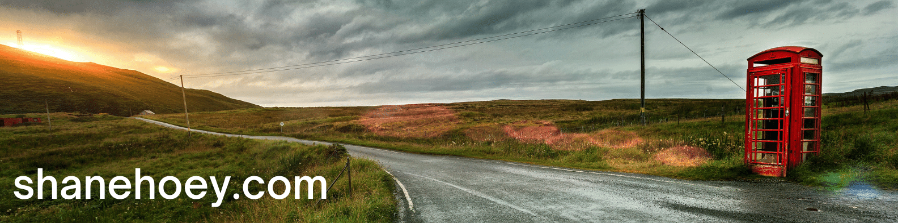

# Shane Hoey

### Hi there 👋, <small> I'm [Shane](https://shanehoey.com/) and live in Australia </small>

🔵 #UCRockstar | #AutomationNinja | #BuiltForTeamwork  
🔵 Microsoft MVP 2011-2022  
🔵 Works for [AudioCodes](https://audiocodes.com)  

<!-- Technology Stack -->
#### Technology Stack

🔵 [AudioCodes Products for Microsoft 365](https://www.audiocodes.com/solutions-products/products/products-for-microsoft-365/)  
🔵 [Micrososoft Teams](https://docs.microsoft.com/en-us/microsoftteams/)  

<!-- Highlights -->
#### Highlights

🔵 [directrouting.guide](https://directrouting.guide)  
🔵 [phone provision](https://github.com/shanehoey/phoneprovision)  
🔵 [teams Tools](https://github.com/shanehoey/Teamstools/)  

<!-- Social -->
---

<!--- BUG - displays dark/light think this fails because its not hosted in github --->

