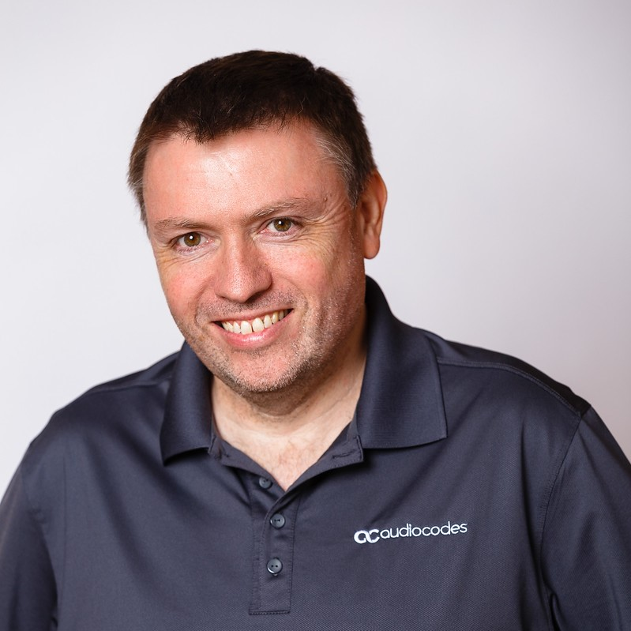

# Shane Hoey - Professional Resume

Modern Workplace Specialist
**@AudioCodes**

 

## Career Highlights

- Over 10 years experience deploying and managing Microsoft Unified Communications solutions, including OCS/Lync/Skype for Business/Microsoft Teams.
- Over 10 year's Automation experience with Windows PowerShell.
- Multiple award recipient of Microsoft MVP award (11 Years) ([mvp.microsoft.com](https://mvp.microsoft.com/en-us/mvp/Shane%20%20Hoey-4030602))
- Speaker at Multiple Microsoft Conferences, including Microsoft Ignite US 2017-2019, Microsoft Ignite the tour, Lync Conference.
- Certifications include Lync/Skype for Business, and currently completing Teams Certifications.

## Professional Profile

Shane as a recognized technical expert in the field of Microsoft Skype for Business & Microsoft Teams:

- As a technology evangelist Shane's Passion is to learn new technologies, combined with his extensive experience, and apply these solutions to real-world situations.
- Shane is a Hands-On and a detail-oriented person with an ability to rapidly acquire new knowledge and possesses considerable technical knowledge and enterprise experience.
- Shane is very effective at Problem Solving, Analytically looking for Solutions by breaking down Complex Technically Environments.

## Core Technology

Shane's currently works with the with the following core technologies with a focus on the delivering Modern Workplace Solutions

- Microsoft Teams/Skype for Business.
- AudioCodes Voice Solutions.
- Windows Powershell/PowerShell Core/Graph API.
- Logic Apps, Power Automate (Automation).

In addition to the above Core Technologies, Shane has an ability to look at solution as a whole across the Enterprise, including understanding the complexity of Enterprise Infrastructure,  Shane can assist not just the voice components, but also across Network, Firewall, Active Directory, Azure, Microsoft Office 365.

## Professional Experience

During his 8 years at AudioCodes, Shane has been focusing providing expertise and guidance on t the AudioCodes portfolio of products, including design, deployment, commissioning, and ongoing maintenance, specifically when used with  Microsoft Skype for Business & Microsoft Teams,  

### Projects Include

- Successful Voice Modernization Projects for Medium to Large Scale Organization covering complex Design across Multiple Countries with Multiple Legacy Equipment.
- More Recently Shane has been providing Customers with Workshop and Design Consulting and assistance with their Microsoft Teams Migration Programs.
- Multiple Deployments of Voice Solutions using Microsoft Teams, Skype for Business Online (Cloud Connector), Skype for Business (Hybrid) and Skype for Business Server.
